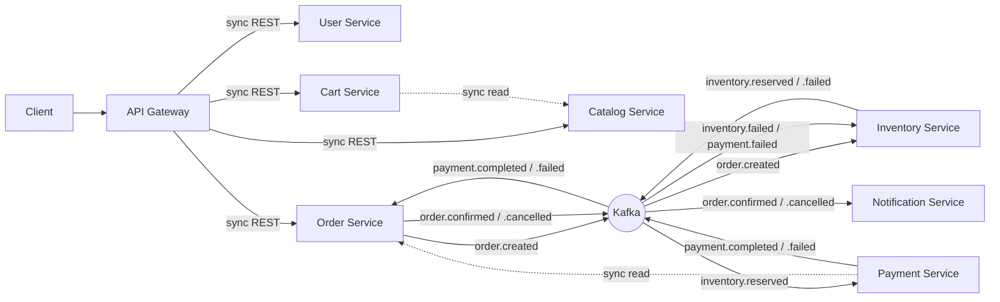

# Checkout Line

A reference e-commerce microservices platform: eight Spring Boot services, a
Kafka-driven choreographed saga for checkout, one database per service, and a
transactional outbox everywhere money or stock is on the line.

This is the working implementation of the architecture below — every pattern
described here (outbox, idempotency keys, compensation, circuit breakers) is
actually wired up in the code, not just documented.

## Services

| Service | Port | Datastore | Owns |
|---|---|---|---|
| `api-gateway` | 8080 | — | Routing, JWT validation, rate limiting |
| `user-service` | 8081 | PostgreSQL | Registration, login, JWT issuing, addresses |
| `catalog-service` | 8082 | MongoDB | Products, categories, prices |
| `cart-service` | 8083 | Redis | Temporary shopping carts (7-day TTL) |
| `inventory-service` | 8084 | PostgreSQL | Stock levels, reservations |
| `order-service` | 8085 | PostgreSQL | Order lifecycle, saga coordination via outbox |
| `payment-service` | 8086 | PostgreSQL | Charges and refunds (mocked), idempotent on `order_id` |
| `notification-service` | 8087 | PostgreSQL | Email/SMS — driven only by events |

`payment-service` has **no public route** through the gateway on purpose — it
is only ever triggered by `inventory.reserved`, never called directly.

## Architecture at a glance



**Rule of thumb used throughout:** reads and validations are synchronous REST
calls (Cart → Catalog for current price, Payment → Order for the amount to
charge); anything that changes state across services goes through Kafka.

## The checkout saga

Choreography, not orchestration — every service reacts to events, no central
coordinator:

1. `POST /orders` → Order Service saves the order as `PENDING` and its
   `order.created` event in the **same local transaction** (the transactional
   outbox — see below), then returns `202 Accepted` immediately.
2. Inventory Service consumes `order.created`, reserves stock for every line
   item, and publishes `inventory.reserved` — or `inventory.failed` if any
   item is short (all-or-nothing, checked before anything is mutated).
3. Payment Service consumes `inventory.reserved`, calls `GET /orders/{id}`
   synchronously to get the amount (a read — not worth an event), and charges
   — publishing `payment.completed` or `payment.failed`.
4. Order Service consumes `payment.completed` → status `CONFIRMED`, publishes
   `order.confirmed`. On `payment.failed` or `inventory.failed` → status
   `CANCELLED`, publishes `order.cancelled`.
5. **Compensation:** Inventory Service also consumes `payment.failed` and
   releases the reservation it made in step 2. Notification Service consumes
   `order.confirmed`/`order.cancelled` and "sends" the email (logged +
   persisted, no real provider wired up).

Every handler is written to be safe under Kafka's at-least-once delivery: a
redelivered `payment.completed` doesn't re-confirm an already-confirmed
order, a redelivered `order.created` doesn't double-reserve stock, and a
redelivered `inventory.reserved` doesn't double-charge a card (the unique
constraint on `payments.order_id` guarantees the last one).

### Try the failure path on purpose

`payment-service`'s mock gateway declines any order over **$500** — this is
the deliberate switch that lets you watch compensation fire without wiring
up a real payment processor. Place two orders, one under and one over $500,
and watch `order-service`'s logs go `PENDING → CONFIRMED` for one and
`PENDING → CANCELLED` for the other, with the stock reservation released in
`inventory-service`'s logs for the cancelled one.

## The transactional outbox

`order-service`, `inventory-service`, and `payment-service` never call Kafka
directly from a request thread. Instead:

1. The business change (save the order, reserve the stock, record the
   payment) and an `outbox_events` row are written in **one JDBC
   transaction** — so "the DB commit succeeded but the Kafka publish failed"
   is structurally impossible.
2. A `@Scheduled` `OutboxPublisher` polls for unpublished rows every 500ms
   and sends them to Kafka, keyed by the order id so every event for one
   order lands on the same partition and processes in order.

`catalog-service` is the one exception: MongoDB has no shared transaction
with Kafka, so `product.updated` is published directly. That's an acceptable
simplification because it's a best-effort cache-invalidation signal, not
money moving.

## Reliability patterns in the code

- **Idempotency key** on `POST /orders` (`Idempotency-Key` header) — a
  retried request returns the original order instead of creating a second one.
- **Optimistic locking** (`@Version`) on `inventory.available_qty` — two
  concurrent reservations for the last unit can't both succeed.
- **`@RetryableTopic`** on every consumer (4 attempts, exponential backoff)
  with a **Dead Letter Topic** catching anything that still fails.
- **Circuit breaker** (Resilience4j) around Payment Service's synchronous
  call to Order Service — an Order Service outage degrades that one call
  instead of jamming the consumer.
- **Reservation expiry** — a `@Scheduled` job in Inventory Service releases
  any stock reservation still `RESERVED` after 15 minutes, so a lost or
  never-sent payment event doesn't hold stock forever. A reservation is
  taken out of the job's reach as soon as `order.confirmed` arrives.
- **Rate limiting** at the gateway — Spring Cloud Gateway's Redis-backed
  `RequestRateLimiter` (20 req/s, burst 40) keyed by user id once a token
  validates, or by IP before that (`/auth/**`, anonymous browsing).

## Running it locally

Requires Docker, JDK 21, and Maven (or use the included `mvn`/your IDE).

```bash
# 1. Infra: Kafka (KRaft), Postgres, Mongo, Redis, Kafka UI
docker compose up -d

# 2. Build every module (shared-events first, via the reactor)
mvn clean install -DskipTests

# 3. Run each service in its own terminal (or via your IDE)
mvn -pl user-service spring-boot:run
mvn -pl catalog-service spring-boot:run
mvn -pl cart-service spring-boot:run
mvn -pl inventory-service spring-boot:run
mvn -pl order-service spring-boot:run
mvn -pl payment-service spring-boot:run
mvn -pl notification-service spring-boot:run
mvn -pl api-gateway spring-boot:run
```

Kafka UI is at `http://localhost:8090` (docker-compose's `kafka-ui`), useful
for watching the saga's events land on each topic in real time.

### Walk through a checkout

```bash
# Register and log in (through the gateway)
TOKEN=$(curl -s -X POST http://localhost:8080/auth/register \
  -H 'Content-Type: application/json' \
  -d '{"email":"a@example.com","password":"password123","fullName":"Ada Lovelace"}' \
  | python3 -c "import json,sys; print(json.load(sys.stdin)['token'])")

# Seed a product and some stock (bypassing the gateway's product routes for admin ops)
PRODUCT_ID=$(curl -s -X POST http://localhost:8082/products \
  -H 'Content-Type: application/json' \
  -d '{"sku":"MUG-001","name":"Checkout Line Mug","price":24.99,"currency":"CAD","attributes":{"color":"black"}}' \
  | python3 -c "import json,sys; print(json.load(sys.stdin)['id'])")

curl -X PUT http://localhost:8084/inventory/$PRODUCT_ID \
  -H 'Content-Type: application/json' \
  -d "{\"productId\":\"$PRODUCT_ID\",\"availableQty\":10}"

# Place an order (through the gateway, with the idempotency key)
curl -X POST http://localhost:8080/orders \
  -H "Authorization: Bearer $TOKEN" -H 'Content-Type: application/json' \
  -H "Idempotency-Key: $(uuidgen)" \
  -d "{\"userId\":\"<userId from register response>\",\"currency\":\"CAD\",\"items\":[{\"productId\":\"$PRODUCT_ID\",\"nameSnapshot\":\"Checkout Line Mug\",\"quantity\":2,\"unitPrice\":24.99}]}"

# Watch it move from PENDING to CONFIRMED
curl http://localhost:8080/orders/<orderId>
```

## What's deliberately simplified

This is a reference/demo build, not a production deployment:

- **`ddl-auto: update`** instead of Flyway/Liquibase migrations.
- **One Postgres container** hosting five logical databases (`db-init/`),
  instead of five separately managed instances — each service still only
  ever touches its own database.
- **Payment gateway is mocked** — a deterministic $500 decline rule, not a
  real processor integration.
- **JWT secret is a shared config value** (`security.jwt.secret`) instead of
  coming from a secret manager.
- Services find each other by `localhost:<port>` / docker-compose service
  name via env vars, rather than a real service registry or Kubernetes DNS.

## Project layout

```
ecommerce-microservices/
├── shared-events/        Kafka event contracts (Java records)
├── api-gateway/           Spring Cloud Gateway + JWT validation
├── user-service/          Postgres + Spring Security + JJWT
├── catalog-service/       MongoDB
├── cart-service/          Redis
├── inventory-service/     Postgres, optimistic locking, outbox
├── order-service/         Postgres, outbox, saga coordinator
├── payment-service/       Postgres, outbox, circuit breaker
├── notification-service/  Postgres, terminal saga consumer
├── db-init/               Postgres init script (one DB per service)
└── docker-compose.yml     Kafka (KRaft), Postgres, Mongo, Redis, Kafka UI
```
